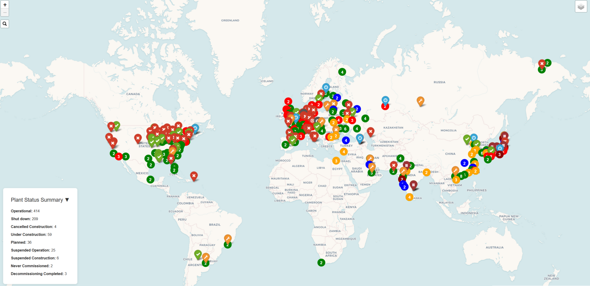

# Nuclear Energy Map

The purpose of the project is to visualize the location of nuclear reactors and their operational status worldwide using the folium library for the map.

## Screenshot

  

> **UI Layout:**  
> - 📊 The statistics bar is located at the **bottom left** and is **collapsible**.
> - 🔍 The **search box** is on the **top left side**.  
> - ⚙️ The **filter** to select reactors by operational status is on the **top right side** and is **collapsible**.

## License

This project is licensed under the MIT License. See the [LICENSE](licenses/LICENSE) file for details.

### Data Source

This project uses data from the GeoNuclearData database:

Copyright (c) 2015-2024 Cristian Stoica.  
The GeoNuclearData database is made available under the Open Database License whose full text can be found at https://opendatacommons.org/licenses/odbl/1.0/.  
It is also included in the project files, see [odbl](/licenses/odbl-10.txt) file for details.

Any rights in individual contents of the database are licensed under the Database Contents License whose full text can be found at https://opendatacommons.org/licenses/dbcl/1.0/.  
Repository: [GeoNuclearData GitHub](https://github.com/cristianst85/GeoNuclearData)
